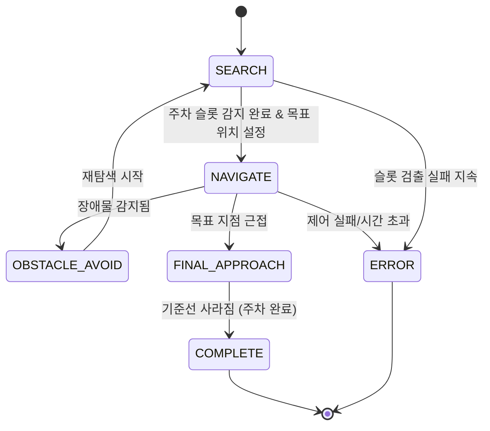

### **0. 문제 인식** 
- **킥보드 방치 문제**
- 보행자의 안전을 위협하고, 교통약자의 이동 불편을 야기

### **1. 하드웨어 구성**

- **킥보드 모형**
    - Autodesk Fusion 360으로 설계 후 3D 프린팅 (실험 환경 구현용 모형은 우드락 대체).
    - **GPIO확장HAT**: DFRobot DFR0604
    - (전용 라이브러리: https://github.com/DFRobot/DFRobot_RaspberryPi_Expansion_Board)
  
    - **조향**: SG-5010 서보모터
    - **속도 제어**: L298N 기반 DC 모터 드라이버
- **단일 웹캠**
    - 핸들부에 장착, 영상 인식용
    - 서보모터(MG90S)를 통해 **Tilt (상/하)** 가능: 주차 시 전방 → 하단 각도 전환

---

### **2. 소프트웨어 아키텍처**

- 전체 시스템은 **FSM (Finite State Machine)** 기반으로 설계되며, 상태는 다음과 같이 정의:

- 각 FSM 상태는 `state_machine.py` 내 `_search_step`, `_navigate_step`, `_wait_step`, `_final_approach_step`, `_complete_step` 등으로 나뉘며, 프레임 단위로 처리됨.

---

### **3. 주요 모듈 설명**

### `yolo_detector.py`

- YOLOv5를 활용한 **주차 슬롯 및 장애물 탐지**
- custom 모델 (킥보드), COCO 모델 (사람/자전거 등)을 이중으로 사용

### `monodepth_estimator.py`

- **단안 카메라 기반 거리 추정**
- ratio / ground_plane / hybrid 방식 선택 가능
- config.yaml에서 파라미터 로드 (`monodepth:` 섹션)

### `slot_geometry.py`

- 주차 슬롯 인식 (사각형 감지)
- 기준선 기반 최종 정렬을 위한 reference line 검출

### `path_planner.py`

- A* 기반 경로 탐색 + waypoint angle, distance 등 메타데이터 포함
- 동적 장애물 회피는 FSM에서 `WAIT` 상태로 분리 처리
- `navigate()`는 각 waypoint에 대해 조향·속도 제어 수행

### `controller.py`

- 서보 및 모터 제어. `set_angle`, `set_speed`, `stop`, `map_physical_angle_to_servo` 등 포함
- `steering_and_offset` 함수는 영상 기반 조향 보정

### `pan_tilt_control.py`

- 전방 탐색 시 tilt=0, 주차 시 tilt=45 외 여러 각도로 하향 조정

### `user_io.py`

- 완료 알림 또는 사용자 피드백용 인터페이스 구성

---

### **4. 설정 파일 (`config.yaml`)**

- 모든 파라미터는 `config.yaml`을 통해 통합 관리
- 실제 동작은 모두 `cfg['...']` 방식으로 전달되어 연동됨

---

### **5. 프로젝트 실행 흐름**

1. `main.py` → config 로딩, 객체 생성, `StateMachine.run()` 실행
2. `SEARCH` 상태 → 슬롯 탐지, 장애물 등록, `planner.plan()`으로 경로 생성
3. `NAVIGATE` 상태 → 경로 따라 이동, 위험 감지 시 `WAIT`, 실패 시 `SEARCH` 복귀
4. 목표 인근 도달 시 → `FINAL_APPROACH` (조향/속도 세밀 제어, tilt 하향)
5. 기준선 인식 종료 → `COMPLETE` (주차 완료)
