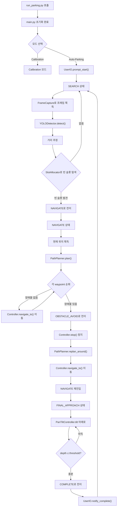

# pi-AutoPark

## 1. 초기화 단계

1. **`main.py`**
    - 애플리케이션 시작
    - `config/config.yaml` 로부터 Geofence, 카메라 파라미터, 사전 정의된 슬롯(좌표·폭·높이) 로드
    - 로거(`utils/logger.py`) 초기화
    - 카메라 캘리브레이션 데이터(`camera/calibration.py`) 불러오기
2. **YOLO 모델 로드**
    - `models/yolo/config.yaml`, `best_weights.pt` 사용
    - `vision/yolo_detector.py` 내부에서 모델 초기화

---

## 2. 주 모드 전환(상태 머신)

`main.py` 에서 크게 두 모드를 순회합니다:

- **Calibration 모드**
- **Auto-Parking 모드**

필요에 따라 `scripts/calibrate_camera.py` 로 별도 캘리브레이션을 수행하기도 합니다.

---

## 3. Auto-Parking 모드 흐름

### 3.1. SEARCH 단계

1. **프레임 획득**
    - `camera/capture.py`: 웹캠 스트림 또는 이미지 파일
2. **슬롯 정보 로드**
    - `config/config.yaml` 에 정의된 슬롯별 **화면 좌표, 폭(width), 높이(height)** 읽어오기
3. **장애물(킥보드) 검출**
    - `vision/yolo_detector.py` ▶ 장애물 바운딩박스 반환
4. **장애물 위치 매핑**
    - `utils/transformations.py` ▶ 바운딩박스 하단 중앙 픽셀을 BEV/GPS 좌표계로 변환 (또는 이미지 픽셀 좌표 그대로 사용)
5. **이동 감지**
    - 이전 프레임과 현재 프레임 바운딩박스 ID 비교 ▶ 킥보드 이동 상태 추적
6. **빈 슬롯 후보 생성**
    - 사전 정의된 슬롯 중, 장애물이 없는 슬롯 리스트 필터링
7. **목표 슬롯 할당**
    - 첫 번째 빈 슬롯을 목표로 설정 ▶ state= NAVIGATE

---

### 3.2. NAVIGATION 단계

1. **GPS 수집 및 변환**
    - `navigation/gps_interface.py` ▶ 현재 `lat, lon` 취득
    - `utils/transformations.py` ▶ BEV ↔ GPS 변환
2. **경로 계획**
    - `navigation/path_planner.py` ▶ 목표 위·경도까지 장애물 회피 간단 경로 생성
3. **주행 제어**
    - `navigation/controller.py` ▶ PID 제어로 스티어링·속도 제어
4. **전방 관찰**
    - `camera/pan_tilt_control.py` ▶ Pan 유지, Tilt=0°

---

### 3.3. FINAL_APPROACH 단계

1. **근접 임계치 도달 감지**
    - `utils/distance.py` ▶ 현재 위치와 목표점 거리 확인
2. **정밀 모드 전환**
    - `camera/pan_tilt_control.py` ▶ Tilt → 아래 보기(예: −30°)
3. **바닥 패턴 추출**
    - `vision/hough_transform.py` 또는 `monodepth_estimator.py` ▶
        - 바닥 라인, 격자 마킹, 깊이 맵으로 정확한 칸 중앙 보정
4. **Fine-Control**
    - `navigation/controller.py` ▶ 짧은 거리 PID 조향/속도 제어

---

### 3.4. COMPLETE 단계

1. **주차 완료 로깅**
    - `utils/logger.py` ▶ 최종 `lat, lon` 서버 전송
2. **상태 초기화**
    - 다음 반납 요청을 위해 `state = SEARCH`

---

## 4. 테스트 및 검증

- **단위 테스트**(`tests/`)
    - `test_camera.py`: 웹캠 vs 이미지 입력 인터페이스
    - `test_vision.py`: Hough, IPM, YOLO 검출, Monodepth
    - `test_slot_allocator.py`: 다양한 장애물 배치에서 슬롯 선택 로직
    - `test_navigation.py`: GPS↔BEV 변환, path_planner, controller 출력 검증
